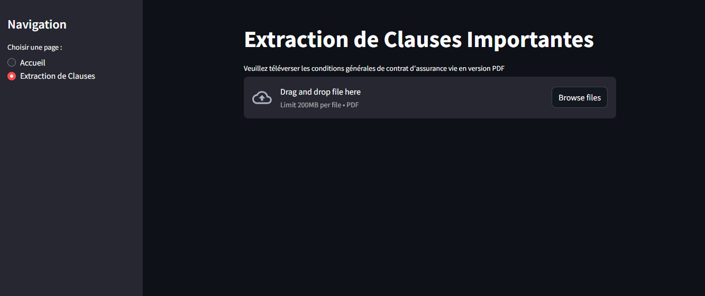
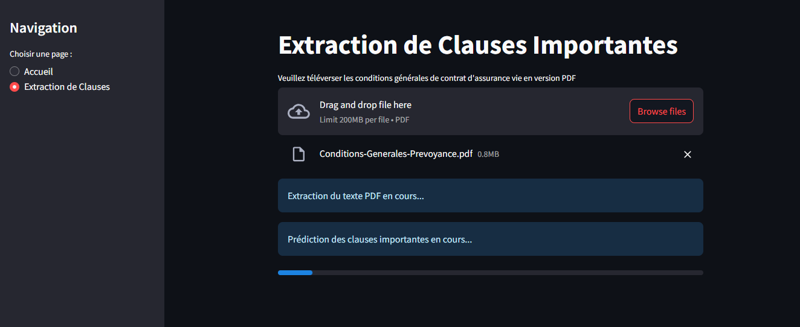
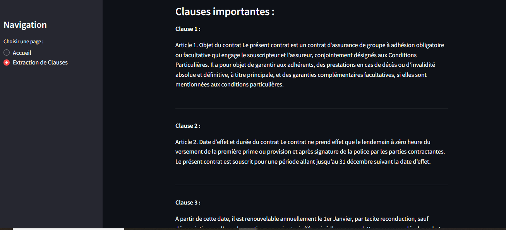
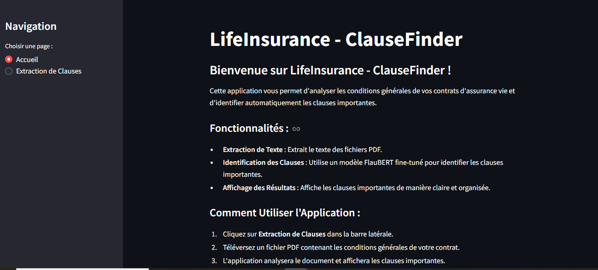

# LifeInsurance - ClauseFinder

## Description
**LifeInsurance - ClauseFinder** est une application Streamlit qui permet d'analyser les conditions générales des contrats d'assurance vie et d'identifier automatiquement les clauses importantes. L'application utilise un modèle FlauBERT fine-tuné pour prédire les clauses importantes et les afficher de manière claire et organisée.

## Fonctionnalités
- **Extraction de texte** : Récupération du contenu des contrats d'assurance au format PDF.
- **Nettoyage et structuration** : Suppression des espaces inutiles et regroupement des lignes en paragraphes cohérents.
- **Classification automatique** : Identification des clauses importantes à l'aide d'un modèle NLP entraîné.
- **Interface interactive** : Utilisation de **Streamlit** pour une interaction simple et intuitive.


## Technologies utilisées
- **Streamlit** : Framework pour créer des applications web interactives en Python.
- **PyTorch** : Bibliothèque de machine learning utilisée pour entraîner et exécuter le modèle FlauBERT.
- **Transformers (Hugging Face)** : Bibliothèque pour utiliser des modèles de traitement du langage naturel (NLP) comme FlauBERT.
- **PyMuPDF (fitz)** : Bibliothèque pour extraire le texte des fichiers PDF.
- **NLTK** : Bibliothèque pour le traitement du langage naturel (tokenisation des phrases).
- **Pandas** : Bibliothèque pour la manipulation des données (utilisée dans le fine-tuning du modèle).
- **Scikit-learn** : Bibliothèque pour le calcul des métriques (précision, etc.).

---

## Comment Utiliser l'Application

1. **Téléverser un PDF** :
   - Accédez à la page **Extraction de Clauses**.


   - Téléversez un fichier PDF contenant les conditions générales de votre contrat d'assurance vie.

2. **Analyse Automatique** :
   - L'application extrait le texte du PDF et identifie les clauses importantes.


3. **Résultats** :
   - Les clauses importantes sont affichées avec un style clair et lisible.

---

## Installation et exécution
### 1. Cloner le projet
```bash
git clone https://github.com/Rodmigniha/LifeInsurance-ClauseFinder.git
cd LifeInsurance-ClauseFinder
```

### 2. Installer les dépendances
Nous recommandons l'utilisation de **Poetry** pour gérer les dépendances.
```bash
poetry install
```
Si vous utilisez `pip` :
```bash
pip install -r requirements.txt
```

### 3. Fine-tuning du modèle
Assurez-vous d'avoir un fichier de données annotées (`data/contrats_annotes.xlsx`).
```bash
python fine_tune.py
```

### 4. Exécuter l'application
```bash
streamlit run main.py
```
L'application sera accessible via `http://localhost:8501/`.

1. Page d'accueil : Découvrez les fonctionnalités du chatbot et choisissez un mode dans la barre latérale.

2. Mode extraction de clauses: Téléversez un fichier PDF contenant les conditions générales de votre contrat et l'application analysera le document et affichera les clauses importantes.

## Déploiement
L'application peut être déployée sur **Hugging Face Spaces**, **Google Cloud Run**, ou toute autre plateforme supportant **Streamlit**.

## Structure du projet
```
LifeInsurance-ClauseFinder/
├── fine_tune.py        # Script de fine-tuning du modèle FlauBERT
├── main.py             # Interface utilisateur avec Streamlit
├── utils.py            # Fonctions utilitaires (extraction, nettoyage, prédiction)
├── requirements.txt    # Liste des dépendances (si Poetry n'est pas utilisé)
├── README.md           # Documentation du projet
└── data/               # Dossier contenant les données annotées et modèles fine-tunés
```

## Contributions
Les contributions sont les bienvenues ! N'hésitez pas à ouvrir une **issue** ou une **pull request**.

## Auteur
[Rodrigue MIGNIHA](https://github.com/Rodmigniha)

📧 Contacts :
- rodrigue.pro2020@gmail.com
- kidam.migniha@gmail.com


